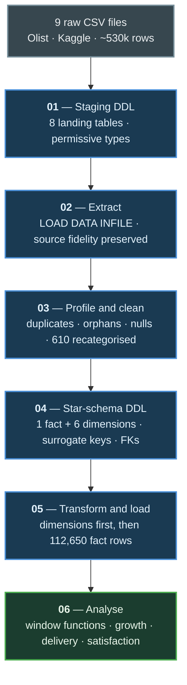
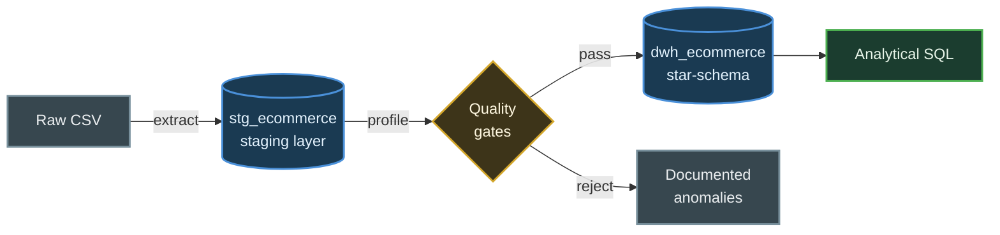
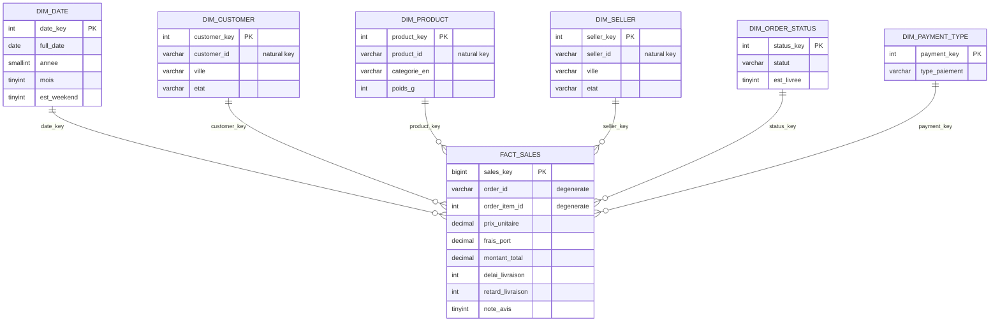
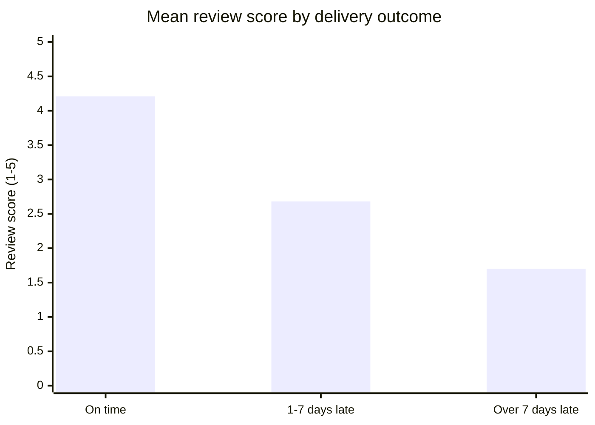

# E-Commerce Data Warehouse — Star Schema & ELT Pipeline

A dimensional data warehouse built on MySQL from raw Brazilian e-commerce data:
9 CSV files → staging layer → quality profiling → star-schema → analytical SQL.

**112,650 fact rows · 6 dimensions · 15.8M BRL of transactions modelled**

---

## Pipeline roadmap



Each stage is one numbered SQL script in this repository. They are designed to be
run in order against a clean MySQL instance.

## Architecture



| Layer | Purpose |
|---|---|
| `stg_ecommerce` | Raw landing zone. Permissive types, no constraints, source fidelity preserved |
| `dwh_ecommerce` | Conformed star-schema. Surrogate keys, enforced FKs, business-ready |

This is an **ELT** pattern, not ETL: raw files land untouched, and all cleaning,
key generation and conformance logic runs as SQL inside the database. That keeps
transformations version-controlled, testable, and re-runnable.

## Star-schema



<details>
<summary>Rendered EER diagram from MySQL Workbench</summary>


</details>

### Grain

**One row in `fact_sales` = one line item within one order**, identified by
`(order_id, order_item_id)`.

Choosing the finest available grain means every higher-level aggregation — per
order, per day, per category — remains derivable. The reverse is not true:
aggregating at load time destroys detail permanently. The grain is enforced in
the database itself through a composite unique constraint, so a duplicate load
fails loudly rather than silently doubling revenue.

### Dimension sizes

| Dimension | Rows | Notable attributes |
|---|---|---|
| `dim_date` | 1,461 | Year, quarter, month, weekday, weekend flag |
| `dim_customer` | 99,441 | City, state, zip prefix |
| `dim_product` | 32,951 | Category (PT + EN), weight, dimensions |
| `dim_seller` | 3,095 | City, state |
| `dim_order_status` | 8 | Status, delivered flag |
| `dim_payment_type` | 5 | Payment method |

### Design decisions

- **Surrogate keys** on every dimension, decoupling the warehouse from
  source-system identifiers and leaving room for SCD Type 2 history.
- **Star, not snowflake.** Category names are denormalised into `dim_product`
  rather than split into a lookup table — fewer joins, faster aggregation.
- **Degenerate dimensions.** `order_id` lives in the fact table; it identifies a
  transaction but carries no descriptive attributes of its own.
- **Payment grain mismatch.** Payments are recorded per order, facts per line
  item. Resolved by attributing each order its highest-value payment method via
  a windowed `ROW_NUMBER()`.

## Key findings

**Late delivery is the dominant driver of customer dissatisfaction.**



| Delivery outcome | Orders | Mean review score |
|---|---|---|
| On time | 102,284 | **4.21** |
| 1–7 days late | 4,031 | 2.68 |
| More than 7 days late | 3,053 | **1.70** |

Satisfaction collapses by 60% once delivery slips past the estimate, and the
effect is already severe within the first week. For an operator this suggests
logistics reliability yields a higher return than price discounting.

**Other observations:**

- Revenue grew roughly 8× year-over-year — 137k BRL in Jan 2017 against 1.11M BRL
  in Jan 2018.
- November 2017 spikes to 7,451 orders against 4,568 the prior month, a 63%
  jump consistent with Black Friday.
- September and December 2016 contain 3 and 1 orders respectively — platform
  test traffic, excluded from trend analysis.

## Data quality

Profiling was run against the staging layer before any dimensional load:

| Check | Result |
|---|---|
| Duplicate natural keys | None |
| Orphaned line items (no matching product) | None |
| Negative or zero prices | None |
| Products with no category | 610 → mapped to `inconnu` / `unknown` |
| Reviews row count | 99,223 of 99,224 — one record lost to an embedded newline inside a free-text comment |

City names were normalised (lowercase, trimmed) and empty strings converted to
`NULL` so that missing values behave consistently in aggregation.

## Repository structure

```
├── 01_staging_tables.sql        # Databases + raw landing tables
├── 02_chargement_csv.sql        # CSV ingestion via LOAD DATA INFILE
├── 03_controle_qualite.sql      # Profiling queries + cleaning
├── 04_schema_etoile.sql         # Star-schema DDL
├── 05_chargement_elt.sql        # Dimension and fact loads
├── 06_requetes_analytiques.sql  # Analytical queries
└── docs/
    └── star-schema.png          # EER diagram
```

## Getting started

**Requirements:** MySQL 8.0+

```bash
# 1. Download the dataset
#    https://www.kaggle.com/datasets/olistbr/brazilian-ecommerce
#    Extract the 9 CSV files to C:/data/olist/ (or edit paths in script 02)

# 2. Enable local file loading
mysql -u root -p -e "SET GLOBAL local_infile = 1;"

# 3. Run the pipeline in order
mysql --local-infile=1 -u root -p < 01_staging_tables.sql
mysql --local-infile=1 -u root -p < 02_chargement_csv.sql
mysql -u root -p < 03_controle_qualite.sql
mysql -u root -p < 04_schema_etoile.sql
mysql -u root -p < 05_chargement_elt.sql
```

Verify the load:

```sql
SELECT COUNT(*) FROM dwh_ecommerce.fact_sales;  -- expect 112,650
```

## Techniques demonstrated

- Kimball dimensional modelling: grain definition, conformed dimensions,
  surrogate keys, degenerate dimensions
- Recursive CTE for calendar dimension generation
- Window functions — `ROW_NUMBER`, `RANK`, `LAG`, `SUM() OVER` — for grain
  resolution and period-over-period growth
- Referential integrity enforced through foreign keys; grain enforced through a
  composite unique constraint
- Defensive date parsing (`NULLIF` + `STR_TO_DATE`) against incomplete source
  timestamps

## Limitations and next steps

- **No incremental load.** The pipeline is full-refresh. Production use would
  need change-data-capture or a watermark column.
- **Type 1 dimensions only.** Customer relocations overwrite history; SCD Type 2
  would preserve it.
- **Geolocation excluded.** The 1M-row geolocation file contains duplicate zip
  prefixes and does not conform to the chosen grain. State-level geography is
  sourced from the customer and seller dimensions instead.
- Natural extensions: a BI layer (Metabase or Power BI), orchestration through
  Airflow, and dbt tests over the transformation logic.

## Dataset

Olist Brazilian E-Commerce Public Dataset — approximately 100k orders placed
between 2016 and 2018, released by Olist under CC BY-NC-SA 4.0.
